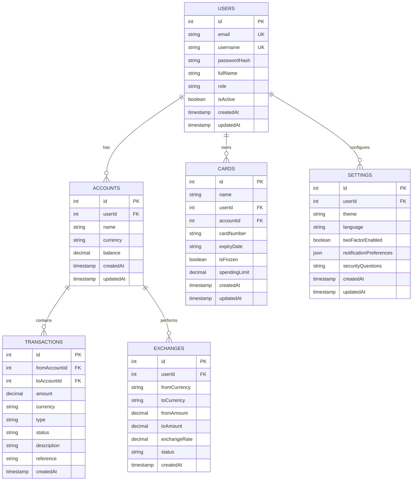

# Schwarzes Schild Banking System 要件定義書

## 1. プロジェクト概要

### 1.1 システム名
Schwarzes Schild Banking System（黒い盾バンキングシステム）

### 1.2 コンセプト
スイスの高級プライベートバンキングを模したデジタルバンキングプラットフォーム。ミニマリストデザインと高度なセキュリティ機能を特徴とする。

### 1.3 ターゲットユーザー
- 高資産個人投資家
- プライバシーを重視する富裕層
- 複数通貨での資産管理を必要とする国際的なクライアント

## 2. 機能要件

### 2.1 認証・セキュリティ機能

#### 2.1.1 ユーザー認証
- **ユーザー名/パスワード認証** ✅ 実装済み
  - Passport.jsローカル戦略による実装
  - scryptによるパスワードハッシュ化
- **2段階認証（2FA）** ⚠️ 部分実装
  - 現在：フロントエンドでのUIシミュレーション
  - 将来：Google Authenticator/SMS連携
- **セッション管理** ✅ 実装済み
  - express-sessionによる実装
  - PostgreSQL（connect-pg-simple）でのセッション永続化
  - セッションタイムアウト機能

#### 2.1.2 セキュリティ機能
- HTTPS通信の強制 ✅ 実装済み
- CSRFトークン保護 ⚠️ 計画中
- XSS対策 ✅ 実装済み（React自動エスケープ）
- SQLインジェクション対策 ✅ 実装済み（Drizzle ORM使用）
- Error Boundary ✅ 実装済み（2025年6月実装）

### 2.2 ダッシュボード機能

#### 2.2.1 ポートフォリオサマリー ✅ 実装済み
- 総資産表示
- 資産配分グラフ（円グラフ）
- 前日比パフォーマンス

#### 2.2.2 マーケット情報 ⚠️ 部分実装
- リアルタイム市場指標（モックデータ）
- 為替レート表示
- マーケットインサイト

#### 2.2.3 コンプライアンス通知 ✅ 実装済み
- KYC/AML状態表示
- 必要書類アラート
- 規制準拠状況

#### 2.2.4 最近の取引 ✅ 実装済み
- 直近の取引履歴表示
- クイックアクセス

### 2.3 口座管理機能

#### 2.3.1 口座情報 ✅ 実装済み
- 複数通貨口座対応（USD, EUR, CHF, GBP, JPY）
- 残高表示
- 口座番号・IBAN表示

#### 2.3.2 口座操作 ⚠️ 部分実装
- 新規口座開設（管理者のみ）
- 口座間振替 ✅ 実装済み
- 口座設定変更 ❌ 未実装

### 2.4 取引機能

#### 2.4.1 取引管理 ✅ 実装済み
- 取引履歴表示
  - 日付範囲フィルター
  - カテゴリーフィルター
  - 検索機能
- 取引詳細表示
- PDFステートメント生成 ❌ 未実装

#### 2.4.2 送金機能 ⚠️ 部分実装
- 国内送金（UIのみ）
- 国際送金（SWIFT）（UIのみ）
- 定期送金設定（UIのみ）

### 2.5 カード管理機能

#### 2.5.1 カード情報 ✅ 実装済み
- バーチャルカード表示
- 物理カード管理
- 利用履歴

#### 2.5.2 カード操作 ⚠️ 部分実装
- カード凍結/解凍 ✅ 実装済み
- 利用限度額設定 ❌ 未実装
- PIN変更 ❌ 未実装
- カード再発行申請 ❌ 未実装

### 2.6 通貨交換機能

#### 2.6.1 為替操作 ⚠️ 部分実装
- リアルタイムレート表示 ✅ 実装済み（外部API連携）
- 通貨交換実行（UIのみ）
- 交換履歴表示（モックデータ）

#### 2.6.2 為替アラート ❌ 未実装
- レート通知設定
- 自動交換設定

### 2.7 管理者機能

#### 2.7.1 ユーザー管理 ✅ 実装済み
- ユーザー一覧表示
- ユーザー詳細確認
- 資金調整機能
- アカウント停止/有効化

#### 2.7.2 統計ダッシュボード ✅ 実装済み
- システム全体の統計
- 取引量分析
- ユーザー行動分析

## 3. 非機能要件

### 3.1 パフォーマンス要件
- ページロード時間: 3秒以内 ✅ 達成
- API応答時間: 500ms以内 ✅ 達成
- 同時接続ユーザー数: 1000人以上 ⚠️ 未検証

### 3.2 可用性要件
- 稼働率: 99.9%以上 ⚠️ 未測定
- 定期メンテナンス: 月1回、深夜帯

### 3.3 拡張性要件
- 水平スケーリング対応 ✅ 実装済み（Vercel/Renderデプロイ）
- マイクロサービス化対応（将来）

### 3.4 互換性要件
- ブラウザ: Chrome, Safari, Firefox, Edge（最新2バージョン）✅ 対応
- モバイル: iOS 14+, Android 10+ ✅ 対応
- 画面解像度: 320px〜4K対応 ✅ 対応

## 4. UI/UXデザイン要件

### 4.1 デザインコンセプト ✅ 実装済み
- **カラースキーム**: 黒（#000000）と白（#FFFFFF）のモノクロ
- **タイポグラフィ**: 
  - ブランド: Playfair Display
  - 本文: システムフォント
- **レイアウト**: ミニマリスト、クリーン、直感的

### 4.2 レスポンシブデザイン ✅ 実装済み
- モバイルファースト設計
- ブレークポイント:
  - モバイル: 〜640px
  - タブレット: 641px〜1024px
  - デスクトップ: 1025px〜

### 4.3 アクセシビリティ ⚠️ 部分対応
- WCAG 2.1 AA準拠（部分的）
- キーボードナビゲーション対応
- スクリーンリーダー対応（基本的なaria-label実装）

## 5. データモデル ✅ 実装済み

### 5.1 主要エンティティ

## 6. API仕様 ✅ 実装済み

### 6.1 認証エンドポイント
- `POST /api/auth/register` - 新規登録 ✅
- `POST /api/auth/login` - ログイン ✅
- `POST /api/auth/logout` - ログアウト ✅
- `GET /api/auth/user` - 現在のユーザー情報 ✅

### 6.2 口座エンドポイント
- `GET /api/accounts` - 口座一覧 ✅
- `PATCH /api/accounts/:id` - 口座更新 ⚠️（残高更新のみ）

### 6.3 取引エンドポイント
- `GET /api/transactions` - 取引一覧 ✅
- `POST /api/transactions` - 取引作成 ✅

### 6.4 カードエンドポイント
- `GET /api/cards` - カード一覧 ✅
- `POST /api/cards` - カード作成 ⚠️（未使用）
- `PATCH /api/cards/:id/freeze` - カード凍結 ✅

### 6.5 交換エンドポイント
- `GET /api/exchanges` - 交換履歴 ⚠️（未使用）
- `POST /api/exchanges` - 通貨交換実行 ⚠️（未使用）

### 6.6 設定エンドポイント
- `GET /api/settings` - 設定取得 ⚠️（未使用）
- `PATCH /api/settings` - 設定更新 ⚠️（未使用）

### 6.7 管理者エンドポイント
- `GET /api/admin/users` - ユーザー一覧 ✅
- `PATCH /api/admin/users/:id/status` - ユーザーステータス更新 ✅
- `POST /api/admin/transfer` - 資金調整 ✅
- `GET /api/admin/stats` - 統計情報 ✅

## 7. セキュリティ要件

### 7.1 認証・認可
- セッションベース認証 ✅ 実装済み
- ロールベースアクセス制御（RBAC）✅ 実装済み（user/admin）
- APIレート制限 ❌ 未実装

### 7.2 データ保護
- 保存時暗号化（パスワードのみ）✅ 実装済み
- 通信時暗号化（HTTPS）✅ 実装済み
- PII（個人識別情報）のマスキング ⚠️ 部分実装

### 7.3 監査・ログ
- 全取引の監査ログ ⚠️ 基本的なログのみ
- ログイン試行の記録 ❌ 未実装
- 異常検知アラート ❌ 未実装

## 8. 外部連携

### 8.1 決済システム ❌ 未実装
- SWIFT/SEPA連携（計画）
- クレジットカード処理（計画）

### 8.2 規制準拠 ❌ 未実装
- KYC/AMLプロバイダー連携（計画）
- 規制報告自動化（計画）

### 8.3 市場データ ✅ 実装済み
- リアルタイム為替レートAPI（Exchange Rate API）
- 市場指標データフィード（モックデータ）

## 9. 開発・デプロイメント

### 9.1 開発環境 ✅ 実装済み
- Node.js 18+
- TypeScript 5+
- React 18+
- PostgreSQL 14+（Neon Serverless）

### 9.2 技術スタック
- **フロントエンド**:
  - React 18 + TypeScript
  - Vite（ビルドツール）
  - Tailwind CSS + shadcn/ui
  - React Query（状態管理）
  - Wouter（ルーティング）
- **バックエンド**:
  - Express.js + TypeScript
  - Drizzle ORM
  - Passport.js（認証）
- **データベース**:
  - PostgreSQL（Neon Serverless）
  - Render（本番環境）

### 9.3 デプロイメント
- Vercel（フロントエンド）✅ 対応
- Render（バックエンド/DB）✅ 対応
- 環境変数管理 ✅ 実装済み

### 9.4 品質管理
- TypeScript型チェック ✅ 実装済み
- ESLint ❌ 未設定
- 自動テスト ❌ 未実装
- Error Boundary ✅ 実装済み

## 10. 現在の実装状況（2025年6月）

### 完成済み機能
- ユーザー認証・セッション管理
- ダッシュボード表示
- 口座管理（表示・振替）
- 取引履歴表示
- カード管理（表示・凍結）
- 為替レート表示（外部API連携）
- 管理者機能（ユーザー管理・統計）
- レスポンシブデザイン
- Error Boundary実装

### 部分実装（UIのみ）
- 2FA認証
- 送金機能
- 通貨交換実行
- セキュリティ設定
- カード詳細管理

### 未実装機能
- メール通知
- PDFステートメント生成
- 実際の決済処理
- KYC/AML連携
- APIレート制限
- 監査ログ

### 最近のデバッグ内容（2025年6月）
- セキュリティ脆弱性の修正
- デッドコード削除（約1900行）
- console.log削除
- Error Boundary実装
- 環境変数の整理
- TypeScriptエラー修正（13件）

## 11. 今後の優先開発項目

### 短期（1-2ヶ月）
1. ESLint設定と実行
2. 自動テストの実装
3. 実際の送金機能実装
4. メール通知機能
5. セキュリティログ実装

### 中期（3-6ヶ月）
1. 2FA実装（Google Authenticator）
2. PDFステートメント生成
3. KYC/AML基本実装
4. APIレート制限
5. 監査ログ強化

### 長期（6-12ヶ月）
1. 決済システム連携
2. モバイルアプリ開発
3. 暗号資産対応
4. AIアドバイザー機能
5. マルチ言語対応