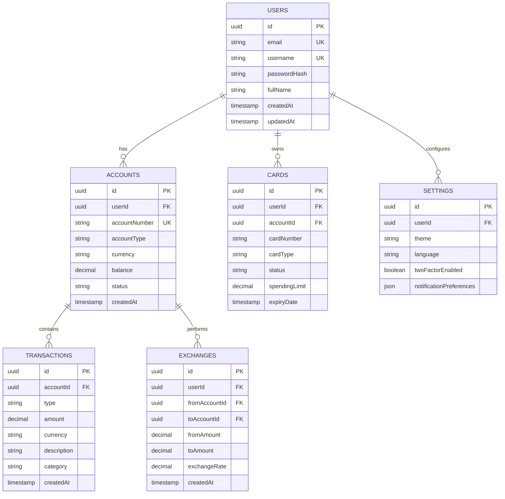

# Schwarzes Schild Banking System 要件定義書

## 1. プロジェクト概要

### 1.1 システム名
Schwarzes Schild Banking System（黒い盾バンキングシステム）

### 1.2 コンセプト
スイスの高級プライベートバンキングを模したデジタルバンキングプラットフォーム。ミニマリストデザインと高度なセキュリティ機能を特徴とする。

### 1.3 ターゲットユーザー
- 高資産個人投資家
- プライバシーを重視する富裕層
- 複数通貨での資産管理を必要とする国際的なクライアント

## 2. 機能要件

### 2.1 認証・セキュリティ機能

#### 2.1.1 ユーザー認証
- **ユーザー名/パスワード認証**
  - Passport.jsローカル戦略による実装
  - scryptによるパスワードハッシュ化
- **2段階認証（2FA）**
  - 現在：フロントエンドでのUIシミュレーション
  - 将来：Google Authenticator/SMS連携
- **セッション管理**
  - express-sessionによる実装
  - セッションタイムアウト機能

#### 2.1.2 セキュリティ機能
- HTTPS通信の強制
- CSRFトークン保護
- XSS対策（React自動エスケープ）
- SQLインジェクション対策（Drizzle ORM使用）

### 2.2 ダッシュボード機能

#### 2.2.1 ポートフォリオサマリー
- 総資産表示
- 資産配分グラフ（円グラフ）
- 前日比パフォーマンス

#### 2.2.2 マーケット情報
- リアルタイム市場指標
- 為替レート表示
- マーケットインサイト

#### 2.2.3 コンプライアンス通知
- KYC/AML状態表示
- 必要書類アラート
- 規制準拠状況

#### 2.2.4 最近の取引
- 直近の取引履歴表示
- クイックアクセス

### 2.3 口座管理機能

#### 2.3.1 口座情報
- 複数通貨口座対応（USD, EUR, CHF, GBP, JPY）
- 残高表示
- 口座番号・IBAN表示

#### 2.3.2 口座操作
- 新規口座開設
- 口座間振替
- 口座設定変更

### 2.4 取引機能

#### 2.4.1 取引管理
- 取引履歴表示
  - 日付範囲フィルター
  - カテゴリーフィルター
  - 検索機能
- 取引詳細表示
- PDFステートメント生成（計画）

#### 2.4.2 送金機能
- 国内送金
- 国際送金（SWIFT）
- 定期送金設定

### 2.5 カード管理機能

#### 2.5.1 カード情報
- バーチャルカード表示
- 物理カード管理
- 利用履歴

#### 2.5.2 カード操作
- カード凍結/解凍
- 利用限度額設定
- PIN変更
- カード再発行申請

### 2.6 通貨交換機能

#### 2.6.1 為替操作
- リアルタイムレート表示
- 通貨交換実行
- 交換履歴表示

#### 2.6.2 為替アラート
- レート通知設定
- 自動交換設定（計画）

### 2.7 管理者機能

#### 2.7.1 ユーザー管理
- ユーザー一覧表示
- ユーザー詳細確認
- 資金調整機能
- アカウント停止/有効化

#### 2.7.2 統計ダッシュボード
- システム全体の統計
- 取引量分析
- ユーザー行動分析

## 3. 非機能要件

### 3.1 パフォーマンス要件
- ページロード時間: 3秒以内
- API応答時間: 500ms以内
- 同時接続ユーザー数: 1000人以上

### 3.2 可用性要件
- 稼働率: 99.9%以上
- 定期メンテナンス: 月1回、深夜帯

### 3.3 拡張性要件
- 水平スケーリング対応
- マイクロサービス化対応（将来）

### 3.4 互換性要件
- ブラウザ: Chrome, Safari, Firefox, Edge（最新2バージョン）
- モバイル: iOS 14+, Android 10+
- 画面解像度: 320px〜4K対応

## 4. UI/UXデザイン要件

### 4.1 デザインコンセプト
- **カラースキーム**: 黒（#000000）と白（#FFFFFF）のモノクロ
- **タイポグラフィ**: 
  - ブランド: Playfair Display
  - 本文: システムフォント
- **レイアウト**: ミニマリスト、クリーン、直感的

### 4.2 レスポンシブデザイン
- モバイルファースト設計
- ブレークポイント:
  - モバイル: 〜640px
  - タブレット: 641px〜1024px
  - デスクトップ: 1025px〜

### 4.3 アクセシビリティ
- WCAG 2.1 AA準拠
- キーボードナビゲーション対応
- スクリーンリーダー対応

## 5. データモデル

### 5.1 主要エンティティ

## 6. API仕様

### 6.1 認証エンドポイント
- `POST /api/register` - 新規登録
- `POST /api/login` - ログイン
- `POST /api/logout` - ログアウト
- `GET /api/user` - 現在のユーザー情報

### 6.2 口座エンドポイント
- `GET /api/accounts` - 口座一覧
- `GET /api/accounts/:id` - 口座詳細
- `POST /api/accounts` - 口座作成
- `PUT /api/accounts/:id` - 口座更新

### 6.3 取引エンドポイント
- `GET /api/transactions` - 取引一覧
- `GET /api/transactions/:id` - 取引詳細
- `POST /api/transactions` - 取引作成

### 6.4 カードエンドポイント
- `GET /api/cards` - カード一覧
- `GET /api/cards/:id` - カード詳細
- `PUT /api/cards/:id` - カード更新
- `POST /api/cards/:id/freeze` - カード凍結

### 6.5 交換エンドポイント
- `GET /api/exchanges` - 交換履歴
- `POST /api/exchanges` - 通貨交換実行
- `GET /api/exchanges/rates` - 為替レート

### 6.6 管理者エンドポイント
- `GET /api/admin/users` - ユーザー一覧
- `GET /api/admin/users/:id` - ユーザー詳細
- `POST /api/admin/users/:id/adjust-balance` - 残高調整
- `GET /api/admin/stats` - 統計情報

## 7. セキュリティ要件

### 7.1 認証・認可
- JWTトークンまたはセッションベース認証
- ロールベースアクセス制御（RBAC）
- APIレート制限

### 7.2 データ保護
- 保存時暗号化（AES-256）
- 通信時暗号化（TLS 1.3）
- PII（個人識別情報）のマスキング

### 7.3 監査・ログ
- 全取引の監査ログ
- ログイン試行の記録
- 異常検知アラート

## 8. 外部連携

### 8.1 決済システム
- SWIFT/SEPA連携（計画）
- クレジットカード処理（計画）

### 8.2 規制準拠
- KYC/AMLプロバイダー連携（計画）
- 規制報告自動化（計画）

### 8.3 市場データ
- リアルタイム為替レートAPI
- 市場指標データフィード

## 9. 開発・デプロイメント

### 9.1 開発環境
- Node.js 18+
- TypeScript 5+
- React 18+
- PostgreSQL 14+

### 9.2 デプロイメント
- コンテナ化（Docker）
- CI/CD（GitHub Actions）
- クラウドプラットフォーム（Vercel/AWS/GCP）

### 9.3 モニタリング
- APM（Application Performance Monitoring）
- エラートラッキング
- ユーザー行動分析

## 10. 今後の拡張計画

### フェーズ1（現在）
- 基本的なバンキング機能
- シンプルな認証
- メモリベースストレージ

### フェーズ2（3ヶ月）
- 実データベース統合
- 本格的な2FA実装
- メール通知機能

### フェーズ3（6ヶ月）
- 投資商品連携
- 高度な分析機能
- モバイルアプリ

### フェーズ4（12ヶ月）
- 暗号資産対応
- AIアドバイザー
- グローバル展開